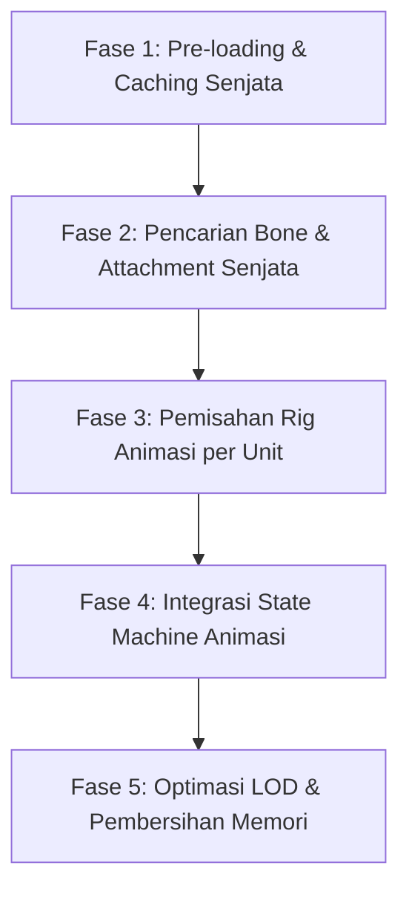

# Hasil Analisis Aset Karakter (Senjata & Animasi)

Dokumen ini berisi hasil pengecekan otomatis aset GLB (Senjata di `/public/models/character/weapons` dan Animasi di `/public/models/character/animation`) serta proposal rekomendasi pencocokan model senjata dan klip animasi untuk setiap unit agar memiliki visualisasi yang unik dan independen.

---

## ⚔️ Daftar Senjata (Weapons) Terdeteksi
Berikut adalah file model senjata yang siap digunakan di dalam game:
* `sword_1handed.glb` / `sword_2handed.glb` / `sword_2handed_color.glb` (Pedang)
* `shield_round.glb` / `shield_round_barbarian.glb` / `shield_round_color.glb` / `shield_square_color.glb` / `shield_spikes_color.glb` (Perisai)
* `axe_1handed.glb` / `axe_2handed.glb` (Kapak)
* `bow.glb` / `bow_withString.glb` (Busur Panah)
* `crossbow_1handed.glb` / `crossbow_2handed.glb` (Busur Silang / Pistol Bow)
* `dagger.glb` (Belati)
* `staff.glb` / `wand.glb` (Tongkat Sihir)
* `spellbook_closed.glb` / `spellbook_open.glb` (Buku Mantra)
* `quiver.glb` (Tempat Anak Panah)
* `smokebomb.glb` (Bom Asap)
* `mug_empty.glb` / `mug_full.glb` (Cangkir Pendekar)

---

## 🏃 Daftar Klip Animasi Terdeteksi per File Rig
Berdasarkan pembacaan data binary GLB, berikut adalah isi klip animasi dari masing-masing file:

### 1. `Rig_Medium_CombatMelee.glb` (Animasi Jarak Dekat)
* **Klip Serang 1-Tangan:** `Melee_1H_Attack_Chop`, `Melee_1H_Attack_Jump_Chop`, `Melee_1H_Attack_Slice_Diagonal`, `Melee_1H_Attack_Slice_Horizontal`, `Melee_1H_Attack_Stab`
* **Klip Serang 2-Tangan:** `Melee_2H_Attack_Chop`, `Melee_2H_Attack_Slice`, `Melee_2H_Attack_Spin`, `Melee_2H_Attack_Spinning`, `Melee_2H_Attack_Stab`, `Melee_2H_Idle`
* **Klip Bertahan:** `Melee_Block`, `Melee_Block_Attack`, `Melee_Block_Hit`, `Melee_Blocking`
* **Klip Dual-Wield (Dua Senjata):** `Melee_Dualwield_Attack_Chop`, `Melee_Dualwield_Attack_Slice`, `Melee_Dualwield_Attack_Stab`
* **Klip Tanpa Senjata:** `Melee_Unarmed_Attack_Kick`, `Melee_Unarmed_Attack_Punch_A`, `Melee_Unarmed_Idle`

### 2. `Rig_Medium_CombatRanged.glb` (Animasi Jarak Jauh & Sihir)
* **Klip Tembak 1-Tangan:** `Ranged_1H_Aiming`, `Ranged_1H_Reload`, `Ranged_1H_Shoot`, `Ranged_1H_Shooting`
* **Klip Tembak 2-Tangan:** `Ranged_2H_Aiming`, `Ranged_2H_Reload`, `Ranged_2H_Shoot`, `Ranged_2H_Shooting`
* **Klip Panahan:** `Ranged_Bow_Aiming_Idle`, `Ranged_Bow_Draw`, `Ranged_Bow_Draw_Up`, `Ranged_Bow_Idle`, `Ranged_Bow_Release`, `Ranged_Bow_Release_Up`
* **Klip Sihir & Summon:** `Ranged_Magic_Raise`, `Ranged_Magic_Shoot`, `Ranged_Magic_Spellcasting`, `Ranged_Magic_Spellcasting_Long`, `Ranged_Magic_Summon`

### 3. `Rig_Medium_General.glb` (Animasi Dasar)
* `Idle_A`, `Idle_B`, `Hit_A`, `Hit_B`, `Death_A`, `Death_A_Pose`, `Death_B`, `Death_B_Pose`, `Interact`, `PickUp`, `Spawn_Air`, `Spawn_Ground`, `Throw`, `Use_Item`

### 4. `Rig_Medium_MovementAdvanced.glb` (Gerakan Khusus)
* `Crawling`, `Crouching`, `Dodge_Backward`, `Dodge_Forward`, `Dodge_Left`, `Dodge_Right`, `Running_HoldingBow`, `Running_HoldingRifle`, `Running_Strafe_Left`, `Running_Strafe_Right`, `Sneaking`, `Walking_Backwards`

### 5. `Rig_Medium_MovementBasic.glb` (Gerakan Dasar)
* `Running_A`, `Running_B`, `Walking_A`, `Walking_B`, `Walking_C`, `Jump_Start`, `Jump_Full_Short`, `Jump_Full_Long`, `Jump_Land`, `Jump_Idle`

### 6. `Rig_Medium_Tools.glb` (Peralatan & Pekerjaan)
* `Chop`, `Chopping`, `Dig`, `Digging`, `Hammer`, `Hammering`, `Saw`, `Sawing`, `Holding_A`, `Holding_B`, `Holding_C`, `Work_A`, `Work_B`, `Work_C`, `Working_A`, `Working_B`, `Working_C`

### 7. `Rig_Medium_Simulation.glb` (Ekspresi)
* `Cheering`, `Waving`, `Lie_Down`, `Lie_Idle`, `Lie_StandUp`, `Sit_Chair_Down`, `Sit_Chair_Idle`, `Sit_Chair_StandUp`, `Sit_Floor_Down`, `Sit_Floor_Idle`, `Sit_Floor_StandUp`

### 8. `Rig_Medium_Special.glb`
* `Skeletons_Awaken_Floor`, `Skeletons_Awaken_Standing`, `Skeletons_Taunt`, `Skeletons_Walking`, `Skeletons_Death`, `EXPERIMENTAL_Medium_Transform`

---

## 🎯 Rekomendasi Pemetaan (Unit Asset Mapping)

Berdasarkan aset yang tersedia, berikut adalah usulan kustomisasi senjata dan animasi yang paling cocok untuk setiap unit:

### 1. Knight (Tank) — Tipe `0`
* **Senjata Kanan (Right Hand)**: `sword_1handed.glb` (atau `axe_1handed.glb`)
* **Senjata Kiri (Left Hand)**: `shield_round_color.glb` (atau `shield_square_color.glb` untuk pertahanan kokoh)
* **File Animasi (Rigs)**: `Rig_Medium_General`, `Rig_Medium_MovementBasic`, `Rig_Medium_CombatMelee`
* **Pilihan Klip**:
  * **Idle**: `Idle_A` (berdiri tegak)
  * **Run**: `Running_A` (berlari membawa senjata)
  * **Attack**: `Melee_1H_Attack_Slice_Horizontal` atau `Melee_1H_Attack_Chop` (tebasan pedang satu tangan)
  * **Death**: `Death_A` (gugur ke depan)

### 2. Archer — Tipe `1`
* **Senjata Kiri (Left Hand)**: `bow_withString.glb` (Busur dipegang di tangan kiri)
* **Aksesoris (Back Attachment)**: `quiver.glb` (wadah anak panah di punggung jika memungkinkan)
* **File Animasi (Rigs)**: `Rig_Medium_General`, `Rig_Medium_MovementAdvanced`, `Rig_Medium_CombatRanged`
* **Pilihan Klip**:
  * **Idle**: `Ranged_Bow_Idle` (pose siap memanah)
  * **Run**: `Running_HoldingBow` (berlari sambil menggenggam busur)
  * **Attack**: `Ranged_Bow_Release` (melepas anak panah)
  * **Death**: `Death_B`

### 3. Mage — Tipe `2`
* **Senjata Kanan (Right Hand)**: `staff.glb` (Tongkat sihir besar)
* **File Animasi (Rigs)**: `Rig_Medium_General`, `Rig_Medium_MovementBasic`, `Rig_Medium_CombatRanged`
* **Pilihan Klip**:
  * **Idle**: `Idle_B` (pose santai tapi waspada)
  * **Run**: `Running_A`
  * **Attack**: `Ranged_Magic_Shoot` (menembakkan energi magis dari tongkat)
  * **Death**: `Death_A`

### 4. Healer (Acolyte) — Tipe `3`
* **Senjata Kanan (Right Hand)**: `wand.glb` (Tongkat sihir pendek)
* **Senjata Kiri (Left Hand)**: `spellbook_open.glb` (Buku mantra terbuka)
* **File Animasi (Rigs)**: `Rig_Medium_General`, `Rig_Medium_MovementBasic`, `Rig_Medium_CombatRanged`
* **Pilihan Klip**:
  * **Idle**: `Idle_A`
  * **Run**: `Running_A`
  * **Attack**: `Ranged_Magic_Raise` (mengangkat tangan untuk memanggil lingkaran cahaya penyembuh)
  * **Death**: `Death_A`

### 5. Gunslinger — Tipe `4`
* **Senjata Kanan (Right Hand)**: `crossbow_1handed.glb` (digunakan sebagai ganti pistol, sangat cocok)
* **Senjata Kiri (Left Hand)**: *Kosong* (atau bisa dual-wield `crossbow_1handed.glb` di kedua tangan agar terlihat *badass*)
* **File Animasi (Rigs)**: `Rig_Medium_General`, `Rig_Medium_MovementAdvanced`, `Rig_Medium_CombatRanged`
* **Pilihan Klip**:
  * **Idle**: `Idle_A`
  * **Run**: `Running_HoldingRifle` (berlari dengan posisi senjata di depan dada)
  * **Attack**: `Ranged_1H_Shoot` (menembakkan panah silang satu tangan)
  * **Death**: `Death_A`

### 6. Assassin — Tipe `5`
* **Senjata Kanan (Right Hand)**: `dagger.glb`
* **Senjata Kiri (Left Hand)**: `dagger.glb` (Dual Daggers)
* **File Animasi (Rigs)**: `Rig_Medium_General`, `Rig_Medium_MovementBasic`, `Rig_Medium_CombatMelee`
* **Pilihan Klip**:
  * **Idle**: `Melee_Unarmed_Idle` atau `Idle_B` (pose membungkuk rendah, sangat cocok untuk pembunuh bayaran)
  * **Run**: `Running_A`
  * **Attack**: `Melee_Dualwield_Attack_Slice` atau `Melee_Dualwield_Attack_Stab` (sayatan dwi-belati cepat)
  * **Death**: `Death_B` (terjatuh dramatis)

### 7. Merchant — Tipe `6`
* **Senjata Kanan (Right Hand)**: `mug_full.glb` (membawa cangkir bir penuh)
* **File Animasi (Rigs)**: `Rig_Medium_General`, `Rig_Medium_MovementBasic`, `Rig_Medium_Tools`
* **Pilihan Klip**:
  * **Idle**: `Idle_A`
  * **Run**: `Walking_C` (berjalan santai ala saudagar)
  * **Attack**: `Hammer` atau `Work_A` (menghantam menggunakan peralatan dagang)
  * **Death**: `Death_A`

### 8. Druid — Tipe `7`
* **Senjata Kanan (Right Hand)**: `spellbook_closed.glb` atau `wand.glb`
* **File Animasi (Rigs)**: `Rig_Medium_General`, `Rig_Medium_MovementBasic`, `Rig_Medium_CombatRanged`
* **Pilihan Klip**:
  * **Idle**: `Idle_B`
  * **Run**: `Running_A`
  * **Attack**: `Ranged_Magic_Summon` (gerakan memanggil tanaman merambat / serigala)
  * **Death**: `Death_B`

---

## 🛠️ Fase-Fase Pengimplementasian (Implementation Phases)

Agar proses pembaruan berjalan optimal, aman, dan tanpa merusak sistem simulasi yang ada (*battle.worker.ts*), berikut adalah 5 fase implementasi bertahap beserta rancangan teknisnya:

### 1. Fase 1: Pre-loading & Caching Aset Senjata
Tujuannya adalah mengunduh semua file `.glb` senjata yang terdaftar di awal proses `changeModel()` secara paralel menggunakan `Promise.all` dan menaruhnya dalam memori cache. Ini menghindari request jaringan berulang saat instansiasi unit.

* **Detail Teknis**:
  * Definisikan daftar senjata unik yang dibutuhkan dari konfigurasi.
  * Buat objek cache global: `const weaponCache: Record<string, THREE.Group> = {};`
  * Gunakan `gltfLoader` di dalam `changeModel` untuk mengunduh semua model senjata secara bersamaan sebelum unit dibuat.

### 2. Fase 2: Pencarian Bone & Logika Attachment Senjata
Tujuannya adalah mendeteksi letak tulang tangan (`Bone`) pada kerangka model karakter dan menempelkan model senjata hasil kloning dengan rotasi & posisi yang pas.

* **Detail Teknis**:
  * Buat fungsi helper `attachWeapon(unitRoot, weaponModel, handType)` yang melakukan traverse rekursif mencari node bertipe `THREE.Bone` yang namanya mengandung kata `hand_r`, `hand_l`, `righthand`, atau `lefthand`.
  * Klone senjata dari cache menggunakan `SkeletonUtils.clone(weaponCache[name])` untuk memastikan material dan struktur mesh terduplikasi secara independen.
  * Definisikan tabel offset transform karena setiap jenis senjata memerlukan koordinat rotasi dan posisi lokal berbeda agar tidak melayang/miring (contoh: Perisai menempel di lengan bawah kiri, sedangkan pedang digenggam di tangan kanan).
  * Simpan referensi objek senjata di visual unit agar dapat dikontrol nantinya.

### 3. Fase 3: Pemisahan Rig Animasi per Unit
Tujuannya adalah memuat rig animasi spesifik dari folder `/animation` untuk unit tertentu daripada menggabungkan dan menggunakan animasi umum yang sama.

* **Detail Teknis**:
  * Muat rig tambahan yang dibutuhkan secara dinamis: `Rig_Medium_CombatRanged.glb`, `Rig_Medium_CombatMelee.glb`, `Rig_Medium_Tools.glb`, `Rig_Medium_MovementAdvanced.glb`.
  * Saat instansiasi mixer untuk unit tertentu, saring klip animasi yang terasosiasi dengan tipe unit tersebut berdasarkan pemetaan `UNIT_ASSET_MAP`.

### 4. Fase 4: Integrasi State Machine Animasi
Tujuannya adalah menghubungkan transisi state animasi di `updateFrame()` dengan klip independen yang telah dipetakan untuk masing-masing unit.

* **Detail Teknis**:
  * Perbarui fungsi `fadeToAnimation()` di `UnitRenderer.ts`.
  * Daripada memanggil nama statis (`Melee_1H_Attack_Chop` untuk semua unit serang), baca nama klip dari konfigurasi unit saat ini (misalnya `Melee_Dualwield_Attack_Slice` untuk Assassin atau `Ranged_Bow_Release` untuk Archer).

### 5. Fase 5: Optimasi LOD & Pembersihan Memori (Memory Cleanup)
Tujuannya adalah memastikan sistem berjalan dengan performa tinggi tanpa kebocoran memori (*memory leak*).

* **Detail Teknis**:
  * **LOD Culling**: Jika unit berada sangat jauh (`distSq > UNIT_LOD_DIST_SQ`), sembunyikan juga objek senjata yang menempel untuk menghemat proses render GPU.
  * **Memory Cleanup**: Saat `changeModel` dipanggil kembali (pergantian skenario), traverse semua unit visual untuk menghapus objek senjata dari bone, panggil `.dispose()` pada geometri dan material senjata hasil kloning, lalu kosongkan `weaponCache` lama.
  * **Death State**: Saat unit mati (`Death`), matikan visibilitas senjata atau buat senjata terlepas jatuh ke tanah (opsional) agar lebih dramatis.